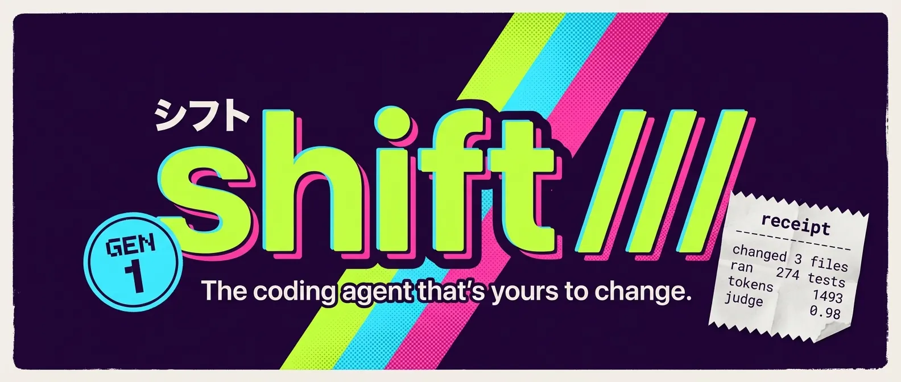
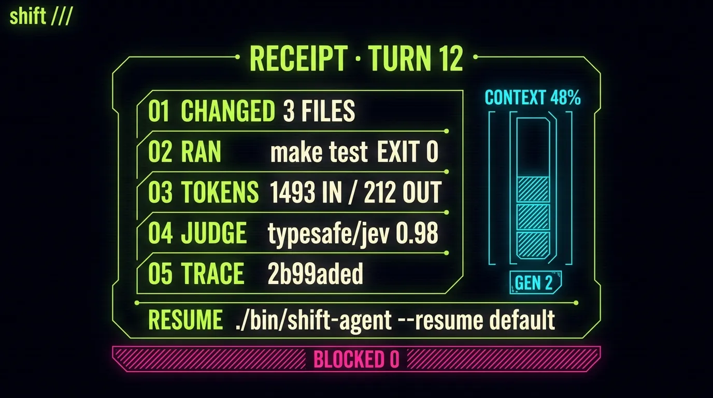
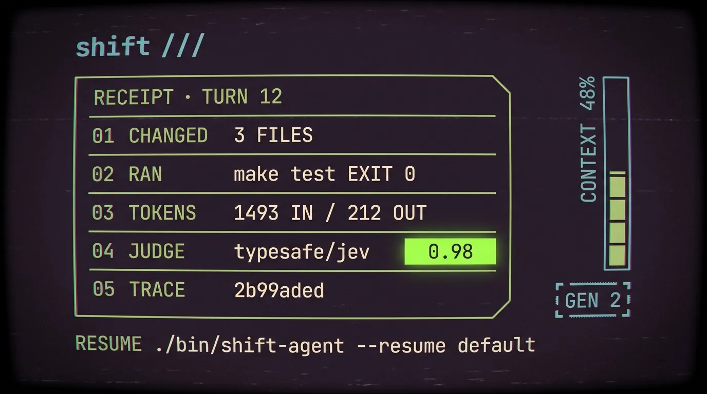

# Shift: the brand

Status: proposal, September 22, 2026. This defines what Shift claims to be
before the website is rebuilt around it. The site today leads with
"an agent, made yours" and hedges every section with "spike", "experiment"
and "not a production coding agent yet". That was true in August. It is not
what the repository holds now, and it undersells the one thing no other agent
offers.

## What Shift is, in one sentence

Shift is a coding agent whose behavior is your own live program: you change
it while it runs, every turn leaves a receipt, and it improves itself under
measurement.

Everything below serves that sentence. If a page, a paragraph or a feature
does not make one of its three clauses more believable, it does not belong on
the site.

## Positioning

Every other coding agent is a product whose behavior belongs to its vendor.
You configure it; you do not own it. Shift inverts that: the permanent
runtime owns authority, transport, tools and the switch between generations,
and the user-owned Scheme image owns the agent. The difference is not a
setting. It is who the agent belongs to.

That claim is what to lead with, and it is defensible because the runtime
enforces the boundary: live changes are validated before they become a
generation, in-flight turns stay pinned, rollback is one command, and no live
change can grant a permission the runtime withheld.

Against the field:

| Them | Shift |
| --- | --- |
| Behavior fixed by the vendor, adjusted through settings and prompts | Behavior is a live image you edit in the session; a validated change is the next generation |
| A transcript | A receipt per turn: files, runs, tokens, judge verdicts, the trace id, the resume command |
| Trust the agent, or approve every step | Three modes, allowlists, a judge with a confidence, and rules that never reach the judge |
| Skills you write | Skills the agent proposes after a hard or a good turn, disabled until you accept them |
| Benchmarks in a blog post | Evals in the repo, with the misses and the reruns written down |
| Cloud first | A local model first; keys and secrets redacted from every log |

## The three pillars, each with its proof

**Yours.** The agent file is Scheme you edit live; `/eval` and the `extension`
tool make generations, `/rollback` undoes one, extensions persist as
artifacts. The terminal is yours too: themes that are also Ghostty themes,
project panes as data, a wordmark you replace. Proof: the generation model in
`docs/coding-workflow-rfc.md`, the live-repair evals, the TUI captures.

**Accountable.** Every turn ends in a receipt. Every session is a folder;
subagents are folders under their parent; traces are searchable from any
session. Policy is explicit: manual, plan, autopilot, run allowlists, a typed
judge (Jev) whose confidence is logged, fixed deny rules that run first.
Proof: `/receipt`, `/judge report`, the judge cases in `evals/judge`, the
redaction tests.

**Compounding.** Workflows are procedures with checks that decide. Field
notes turn each tool rejection into one line every later session reads.
Reflection after a hard turn and distillation after a good one propose
skills, disabled until accepted. `/workflow improve` keeps a change only
when two subagent runs say it won. Proof: `docs/workflows-rfc.md`, the run
records under `.shift/workflows/*/runs`, the versions log.

Measurement is the fourth thing and it is not a pillar; it is the reason the
other three can be claimed at all. The site shows the numbers the repo shows:
the SWE-bench slice, the Terminal-Bench and DeepSWE probes, the judge
agreement, each with its date and its caveat. A number without a caveat is
marketing; Shift's brand is that it does not do that.

## Who it is for

Developers who want to read, change and hold to account the agent they work
with all day. Concretely: people running local models who are tired of agents
that assume a cloud key; people who have hit a vendor agent's ceiling and
want to change the behavior, not file a request; people who need to know
what an agent did to their tree before they commit. Not: people looking for
a chat window, and not people who want an agent to run unwatched for a day
without a receipt.

The maturity statement, said once and plainly: Shift is early. Its author
uses it daily on its own repository, its evals are in the repo, and its
edges are documented. That replaces "spike", "experiment", "toy" and "not
production" everywhere they appear.

## Voice

Plain, specific, evidence first. Short sentences that say what happens. No
adjectives doing the work a fact should do. Numbers only with a date and a
caveat. Second person for the reader, first person never for the agent.

Before and after, from the current site:

| Now | Instead |
| --- | --- |
| "An agent, made yours." | "Your agent. Live, and on the record." |
| "Shift is a tiny coding-agent harness with a live Scheme heart." | "Shift is a coding agent whose behavior is your own live program." |
| "An executable spike. Not a production coding agent yet." | "Early, used daily, measured in the repo." |
| "Your tools feel better when they feel like you." | "Change the agent while it runs. Read the receipt when it stops." |
| "A Shift experiment. Make the agent your own." | "Shift. The coding agent that belongs to you." |

Words retired: spike, experiment, toy, tiny, heart, playground, magic.
Words kept: live, generation, receipt, trace, judge, workflow, yours.

## Name and mark

The name stays Shift; the command stays `shift-agent` because `shift` is a
shell builtin, and the site says so once. The wordmark is `shift ///`; the
three strokes are the mark, and they move only while the agent works. That
motion is the one animation the brand owns, and it means the same thing on
the site as in the terminal: work in progress, not decoration.

Tagline, recommended: **The coding agent that's yours to change.** It states
the ownership claim, it is a promise the runtime can keep, and it survives
without the word "live", which readers outside Lisp do not feel.
Alternatives considered: "Change the agent while it runs" (true, narrower),
"An agent with a receipt" (true, leads with the audit trail rather than the
ownership), "Own your agent" (a slogan, not a sentence).

## Visual system

- **Palette:** the acid theme, aged like tape. The base is the Acid
  palette with its chroma pulled down and its lightness lifted, the way a
  bright label goes milky: a dusty plum canvas, faded lime for strokes and
  labels, faded cyan for secondary strokes, faded magenta for the one thing
  on a screen that is not resolved, warm paper for figures. The vivid acid
  colors survive as highlights only, one per screen, and on the web they
  are written in OKLCH past the sRGB gamut so a wide-gamut display shows a
  lime, cyan and magenta no hex can name; every token carries an sRGB
  fallback for the rest. `site/lab/tokens.css` is the source of truth and
  `site/lab/palette.html` shows each token beside its fallback. The TUI
  keeps the Acid theme as it is; the site is the aged print of it.

| Token | Role | OKLCH | sRGB fallback |
| --- | --- | --- | --- |
| `--plum` | canvas, aged | `oklch(25% 0.065 318)` | `#2e1635` |
| `--plum-deep` | canvas, deeper | `oklch(17% 0.05 316)` | `#18071e` |
| `--lime-faded` | strokes and labels | `oklch(82% 0.16 125)` | `#add658` |
| `--cyan-faded` | secondary strokes | `oklch(76% 0.1 212)` | `#59c2d6` |
| `--magenta-faded` | the one warning element | `oklch(64% 0.18 350)` | `#d8559b` |
| `--paper` | figures and body | `oklch(91% 0.02 80)` | `#e8e0d3` |
| `--lime-hi` | highlight, beyond sRGB | `oklch(93% 0.31 128)` | `#aaff00` |
| `--cyan-hi` | highlight, beyond sRGB | `oklch(88% 0.17 210)` | `#00f4ff` |
| `--magenta-hi` | highlight, beyond sRGB | `oklch(70% 0.32 350)` | `#ff00b9` |

  The first aged set went too far: base chroma has since come back up
  (lime 0.11 to 0.16, cyan 0.07 to 0.10, magenta 0.13 to 0.18, plum 0.045 to
  0.065) while the highlights stayed where they were. Bright but muted with
  age, not grey.
- **Strokes:** hairline. One CSS pixel at 1x, never a glow. Labels in a
  condensed sans at modest weight, figures in monospace.
- **Artifacts:** tape, not neon. Chroma fringes on type (a cyan shadow one
  pixel left, magenta one pixel right, both at low alpha), a soft tracking
  band that drifts once every several seconds, faint scanlines at eight
  percent, a vignette. Sparingly, and all off under reduced motion.
- **Type:** one monospace family for everything the agent says or shows,
  one humanist sans for the site's own voice. Code is never set in the sans.
- **Imagery:** real captures of the real TUI, rendered from PTY recordings
  (the capture harness exists), never the simulated terminal. The simulated
  terminal survives only as the try-it-without-a-model demo, below the fold,
  labelled as a simulation.
- **Motion:** the `///` mark while work runs; the tracking band; nothing
  else moves.
- **Layout:** the receipt is a recurring visual element: a bordered block
  with files, runs, tokens, judge. It appears on the hero capture, in the
  accountability section and at the end of the install section as "your
  first receipt".

## The site, section by section

1. **Hero.** Wordmark, the tagline, one sentence of what it is, one real
   capture with a receipt visible, `brew install thrashr888/tap/shift`.
2. **Change it while it runs.** `/eval`, a validated generation, `/rollback`.
   A capture of a live change and the line that says which generation is
   current.
3. **Every turn leaves a receipt.** The receipt block, annotated. Sessions
   and subagents as folders. `/recall` across sessions.
4. **Policy you can read.** Modes, allowlists, the judge with its confidence,
   the rules that run first. One line on Jev with its date.
5. **Workflows that improve themselves.** A workflow file, its run record,
   a field note, a proposed skill, an improve log line: kept or discarded,
   and why.
6. **Measured.** The evals table from `docs/evals-rfc.md`, dated, with
   caveats. This section is the brand's spine; it is what makes the rest
   believable.
7. **Make it yours.** Themes, Ghostty, panes, the wordmark. Demoted from
   first to seventh; still true, no longer the headline.
8. **Start.** Install, first session, the demo without a model, the docs.

The theme and display-name controls that today sit above the hero move
into section seven. The first screen shows Shift, not a control panel.

## Visual explorations, September 23, 2026

Ten mocks in `docs/assets/brand/`, generated against the palette above and
reviewed for what they say, not how pretty they are. Generated text is never
site material: the desk mock invented a `--model gpt-4o` flag, which is the
whole argument for real captures and set type.

**1. The videotape label** (`label-sleeve.webp`, `label-hero.webp`).
The 1980s Japanese blank-cassette language, modernized: rounded geometric
sans wordmark with cyan and magenta offset shadows, a diagonal three-stripe
band in the palette, katakana `シフト` as a small secondary mark, a round
grade badge that reads `GEN 1` (generations are the product's own word for
versions of itself), and the receipt printed as a torn paper sticker. This is
the recommended primary system. It carries the retro vibe the way the
reference does, it is flat and printable so it survives at every size, and
the sticker gives the receipt, the brand's proof element, a physical form
that repeats across the site. The `GEN N` badge and the sticker are the two
motifs to keep even if the stripes go.

**2. Vector wireframe** (`wireframe-title.webp`, `wireframe-workflow.webp`).
The early-1980s vector-display look from the reference frame: thin glowing
lines, no fills, faint scanlines. It is the right language for anything
structural: a workflow as boxes and arrows with its checks beneath, sessions
as folders, a generation switch, the wireframe globe. The recommendation is
to build these as real SVG, drawn on scroll (stroke-dashoffset), with the
globe as the one continuous motion beside the `///` mark. Secondary system,
for diagrams only; the wordmark stays the label sans.

**3. Dither** (`dither-desk-generated.webp`, `dither-real-composite.webp`,
`dither-capture-lesson.webp`). Ordered (Bayer) dither in two colors, lime on
purple, is the texture that ties photography to the palette. The real
composite proves the pipeline: a photograph dithered by a 4x4 Bayer matrix
at 3-pixel cells, with the wordmark, tagline and receipt composited crisp on
top. The lesson image is the TUI capture itself dithered: the interface
becomes unreadable. Rule: dither imagery, never type or UI. On the site this
is a canvas or WebGL shader over photographs and over captures' backgrounds,
with cell size tied to device pixel ratio so it never looks like JPEG noise.

**4. Gaussian splat** (`splat-still.webp`). A scanned desk with a slow
pointer parallax would be the one photographic moment on the site, with the
tagline set over it. Pipeline: a thirty-second phone video of a real desk
running Shift, reconstructed with Luma or Polycam (or nerfstudio's gsplat
locally), exported as `.splat` or `.ply`, rendered with gsplat.js or
three.js GaussianSplats3D. Budget: a scene under 8 MB, loaded after first
paint, the dithered still as the fallback and for reduced motion. It needs a
real scan, which means a real desk; the mock is a placeholder for the
decision, not the asset.

**5. Outrun** (`outrun-dropped.webp`). The neon grid reads as every other
synthwave page. Dropped; the label and the wireframe already carry the era
without the cliché.

**Wordmark** (`wordmark-sheet.webp`, `wordmark-dither.png`). Of six
treatments, three survive: the rounded label sans for print and the hero,
monospace with a block cursor after the slashes for the terminal and the
receipt, and the ordered-dither bitmap, which reads as late-1990s game type
and is the one Paul reached for first. `wordmark-dither.png` is a real
asset, not a mock: the mark set in a heavy sans, a lime to cyan to magenta
gradient dithered by the 4x4 Bayer matrix into the three palette colors,
thinning to dots toward the top edge. It is the favicon and section-heading
candidate; the label sans remains the mark at hero scale, where dither
cells would be the size of a fingernail.

**The readouts** (`readout-workflow.webp`, `readout-receipt.webp`,
`readout-generation.webp`). The INPUT, PROCESS, OUTPUT boxes in the first
wireframe mock read as generic generated design, so the diagrams take the
readout language of Evangelion's MAGI screens instead: heavy condensed
all-caps labels, bracket frames with clipped corners, numbered fields,
status words, one hatched magenta element for the thing that is not
resolved. Same strokes, same palette, no boxes with arrows.

The first three readouts (`readout-*.webp`) came back too acid and too
thick: full-saturation strokes with a neon glow. The second set
(`vhs-receipt.webp`, `vhs-workflow.webp`, `vhs-hero.webp`) is the
register to keep: hairline strokes, the palette gone milky with age, chroma
fringes, a tracking band, and exactly one vivid element per screen, the
`0.98`, the `OK`, the `///`. That single highlight is where the OKLCH
colors go.

Three mocks, and the receipt is the one to build first: five numbered
fields, a context bar, a `GEN` stamp, the resume line, and the blocked
count as the one hatched strip. It is the accountability section's whole
argument on one screen. The workflow readout turns steps into numbered
panels stamped `OK` or `PENDING`, with the round budget as the footer bar;
the generation switch puts the active and candidate images side by side
with `ATOMIC` on the seam and `ROLLBACK AVAILABLE` and `NO NEW PERMISSIONS`
as the two strips beneath. All three become SVG built from real receipts,
run records and generation data, which is also the caveat the mocks make
for themselves: the model repeated the same three checks in every workflow
panel, and padded the generation screen with invented `STATUS: OPTIMAL`
telemetry rows and hex fields. Every field on the site is a field the
product actually has.

**The Mac II direction** (`mac-title.webp`, `mac-receipt-window.webp`).
Paul's other favorite from round one was the 1-bit acid look: lime on plum
with nothing in between, coarse Bayer dots for every tone, one-pixel
outlines, Chicago-style bitmap type, System 6 window chrome. Two mocks push
it: a game title screen with the wordmark dithering from solid to dots over
a desk, a moon and a mug, and a receipt as a System 6 window over a
dithered desktop with a `workflows` window behind it. It is a real
candidate for the install section and for empty states in the TUI itself,
where two colors and a bitmap font are native. The second mock carries an
Apple mark the model added on its own; a real trademark never ships, and
the window chrome should be Shift's, not System 6's. The dither lab now has
a `1-bit acid` palette beside `aged tape` for exactly this look; the aged
palette is its default and is read from `tokens.css`, so the lab and the
site agree.

**Where it converged, September 23.** From everything above, Paul kept
seven images: the dither lab, the dithered photo composite, the dithered TUI
capture, the iridescent dot wordmark, the 1-bit desk illustration, the
sakura chroma cover, and the aged hero. The through-line is one texture,
dither and halftone, in three registers, and no operating-system chrome:

- **1-bit game scenes** (`scene-rooftop.webp`, `scene-cassette.webp`): the
  language of late-1980s adventure-game backgrounds, coarse Bayer dots for
  every tone, one-pixel outlines, lime on plum and nothing between. Spot
  illustrations for sections: a rooftop with antennas and a terminal on a
  crate, hands sliding a cassette labelled `shift ///` into a deck. The
  Mac II mocks went a step too far into System 6 windows and menus; the
  scenes keep the games and drop the desktop.
- **The halftone cover** (`chroma-cover.webp`): the sakura chroma move, one
  enormous flat symbol through a CRT dot screen. Here the symbol is the
  `///` in faded lime over near-black plum, the wordmark heavy and rounded
  at the bottom right, the tagline and katakana in a condensed line, a
  `GEN 1` stamp, and one vivid detail: the dot of the i. This is the hero
  language and the print language, and the strongest single frame so far.
- **The iridescent wordmark** (`wordmark-iridescent.png`): now a real
  asset, not a sheet. A halftone of round dots whose size follows the
  letterform's coverage, so edges thin to specks, and whose hue drifts
  across a slow field through lime, cyan, magenta and a warm yellow. It
  is the mark for section heads and the favicon; it can be muted by
  running the same field through the aged tokens if the full-saturation
  version reads too loud beside the cover.

**Wordmark, decided.** The round-dot halftone version
(`wordmark-iridescent.png`) is not it; the square-pixel ordered dither from
the exploration sheet is, iridescent but pixel-edged, the way a late-1980s
Sierra title screen dithers a sunset. So the reference era is Sierra's EGA
to VGA years, 1988 to 1991: King's Quest IV to V, 320 by 200, sixteen colors
dithered into more. One year keeps it consistent; borrowing across a few is
fine. The pixel version replaces the halftone one as the mark.

**Fidelity as a conceit.** Paul raised Evoland, where progress unlocks color
and then 3D, and asked whether the site could do the same, or whether that
is nostalgia looking for a home. It fits, on one condition: the product
already has the word for it. Shift's behavior moves through generations, so
the site can too: `GEN 1` is the 1-bit register, `GEN 2` sixteen EGA
colors, `GEN 3` the full palette with the OKLCH highlights and the depth
lab. No achievements, no unlocking by clicking things; the generation
advances as the reader scrolls through the three pillars, and a control in
the corner lets anyone jump. Reduced motion and no JavaScript show `GEN 3`.
Three steps, not a game; a metaphor the product earns rather than a theme
laid over it. The 2-, 8- and 16-bit wordmarks are the first three assets to
make.

**The lab** (`site/lab/dither-depth.html`, served by `python3 -m
http.server --directory site`). A working prototype of two of the ideas
above, with no libraries: the real TUI capture is Bayer-dithered into
points on the CPU, each point given a depth from local contrast so text and
frames sit forward of flat panels, and rendered as WebGL point sprites that
tilt with the cursor. The glitch pass is Alchemy's `glitchField` ported to
the vertex stage: every four-second epoch hides one burst window at a
hashed offset, inside which rows shear on a twelve-hertz tick and flash
magenta. Reduced motion turns both off. It is not a gaussian splat, which
needs a scan; it is the same gesture from a screenshot, and it says whether
the gesture is worth a scan.

What this settles for the site plan above: the hero is the label system
over a dithered photograph or splat; sections two through five use
wireframe SVG diagrams; every capture is real; the receipt sticker appears
in the hero, the accountability section and the install section. Motion is
three things and no more: the `///` mark while work runs, wireframes drawing
themselves once, and splat parallax on pointer.

## Open questions

1. Tagline: the recommendation above, or "Change the agent while it runs"?
2. Does local-first belong in the hero sentence, or in section four? The
   draft keeps it out of the hero: ownership is the claim, local is a
   consequence.
3. How much of the evals table goes on the site: the three headline rows, or
   the whole thing with reruns? The draft says the whole thing; the point is
   that nothing is hidden.
4. Whether to keep the site static HTML in `site/` (no build, no analytics)
   or move it. The draft keeps it: the constraints are part of the brand.
